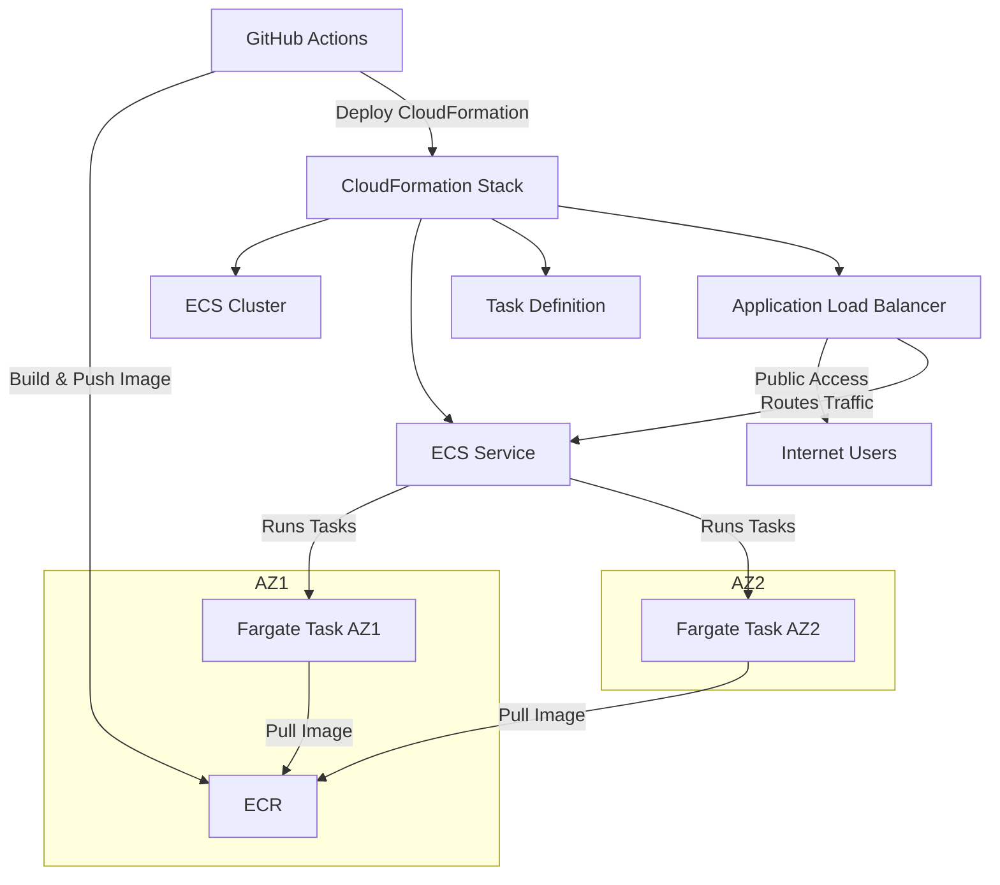

# ECS Fargate Deployment with GitHub Actions + CloudFormation

## 📘 Project Overview
This project demonstrates a fully automated CI/CD pipeline for deploying a containerized Python “Hello” application to **Amazon ECS (Fargate)**, exposed through an **Application Load Balancer (ALB)**.  
The pipeline uses **GitHub Actions**, **Docker**, and **AWS CloudFormation** to build, push, and deploy both the application and infrastructure.

This deployment supports:
- **Multi-AZ** for high availability
- **ECS Fargate task autoscaling** based on CPU/Memory or custom metrics
- Rolling deployments with zero downtime

---

## 📐 Architecture Diagram (Mermaid)


---

## 🚀 Deployment Workflow

### **1. Commit Code → GitHub Actions Triggered**
Pushing to the `main` branch launches two workflows:

### **2. CI (Application, if the changes happen in app subdir)**
- Build Docker image from `app/`
- Tag latest
- Push to **Amazon ECR**
- Trigger CD

### **3. CD (Infrastructure + Service Deployment)**
- Deploy/update CloudFormation stack (`infra/infra.yml`)
- Update ECS TaskDefinition with new image
- ECS performs **rolling deployment**
- ALB directs traffic to healthy tasks
- ECS tasks auto-scale based on configured **CPU/Memory thresholds**

---

## 🔄 CI/CD Overview

### GitHub Actions Workflows
| Workflow | Path | Description |
|----------|------|-------------|
| **App Build & Push** | `.github/workflows/docker-build.yml` | Builds Docker image and pushes to ECR |
| **Infra Deploy** | `.github/workflows/deploy-infra.yml` | Deploys CloudFormation and updates ECS |

### What’s Automated
- Docker image build
- ECR upload
- Infrastructure creation/update
- Multi-AZ ECS deployment
- ECS Task autoscaling
- Zero‑downtime rolling releases

---

## 💸 Cost Estimate (1M Requests / Month)

Assumptions:
- ALB: Always-on (≈744 hours)
- ECS Fargate: 0.25 vCPU / 0.5GB RAM, 1 task per AZ, 2 AZs
- 1M ALB LCU-based requests

| Component | Monthly Estimate |
|----------|------------------|
| **ALB (Load Balancer)** | ~$18 (base) + ~$0.20 per LCU → ~$20 |
| **ECS Fargate Tasks (2 AZ)** | ≈ $26–30 |
| **ECR Storage/Requests** | < $1 |
| **CloudWatch Logs** | ~$1–2 |
| **Total** | **~$50–55 / month** |

---

## 🔐 Security Notes

- No custom domain thus no HTTPS/WAF → Do **not** use for production workloads
- CICD agent uses OIDC and a specific IAM role to interact with AWS, ensuring minimum privilege assigned
- ALB is **public**, ECS tasks are **private** in multi-AZ subnets
- Logging enabled for ECS and ALB

---

## 📌 Assumptions

- User does not use Route53 or custom domain  
- Only one environment (“prod”) is needed
- CloudFormation manages:
  - VPC + subnets (multi-AZ)
  - ECS cluster, service, task definition
  - ALB + target group + listener
  - ECS Task autoscaling
  - IAM roles
- Repository contains both application code and infrastructure code

---

## 📁 Project Structure

```
repo/
├── app/
│   ├── Dockerfile
│   └── src/
│       ├── app.py
│       └── requirements.txt
│
├── infra/
│   └── infra.yml        # Full CloudFormation template (VPC + ECS + ALB + AutoScaling)
│
└── .github/
    └── workflows/
        ├── deploy-infra.yml      # CloudFormation deploy CD
        └── docker-build.yml      # Build + Push image CI
```

---

## 🧪 Testing the Deployment

1. Deploy succeeds
2. Visit:
```
http://helloapp-alb-545299018.ap-southeast-2.elb.amazonaws.com/hello
```
You should see:
```
OK
```

---

## ✔️ Status
This repository is production-ready for:
- Small projects  
- Personal apps  
- Internal tools  
- Demos / education  

For production, add:
- HTTPS (LB https listener 443 + LB http listener 80 redirection + ACM + R53 record)
- WAF
